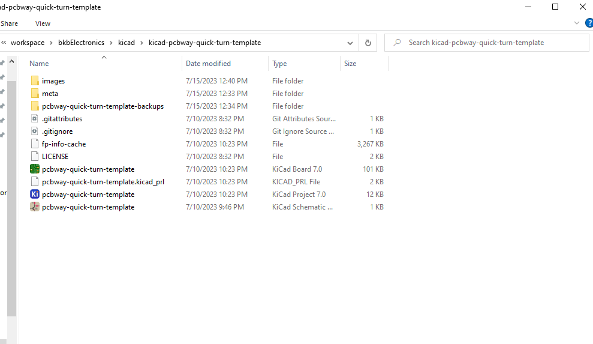
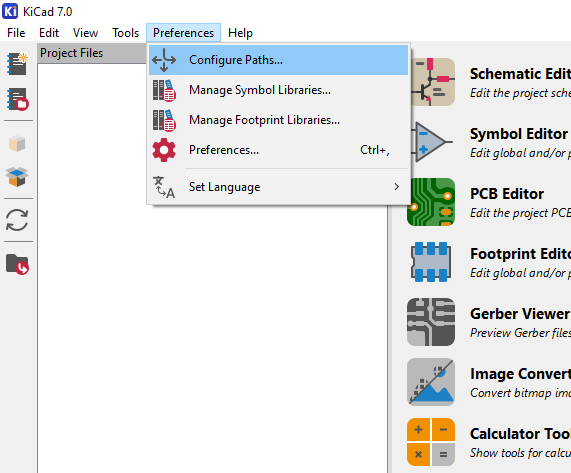
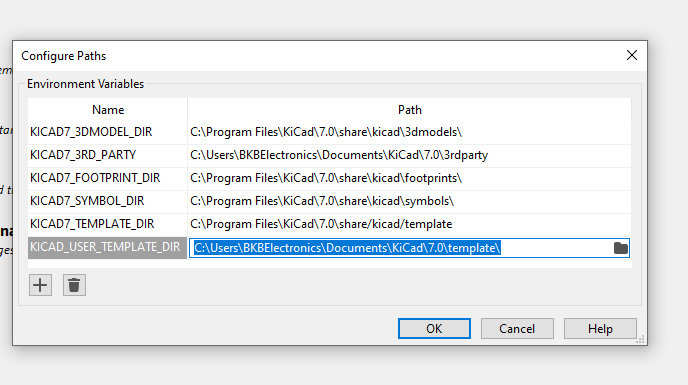
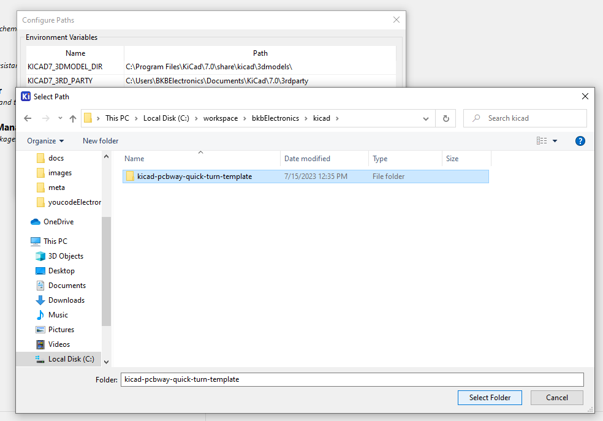
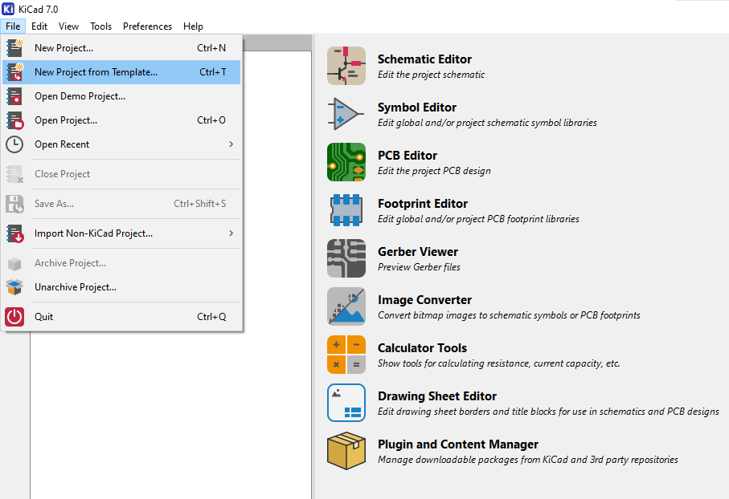
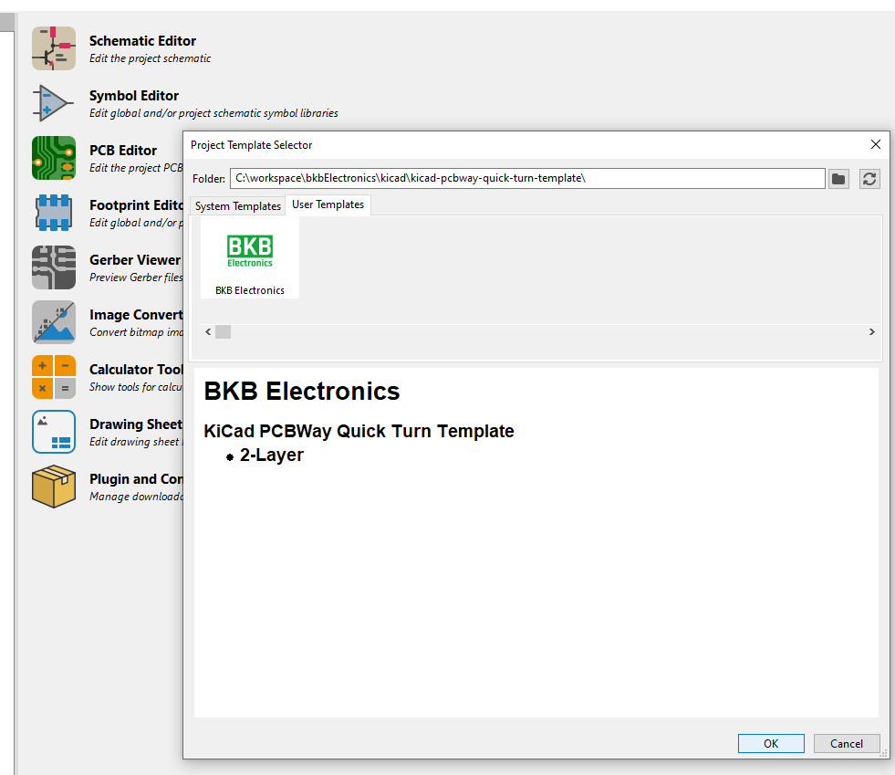

# How to use KiCad PCBWay Quick Turn Template

## Step 1 - Clone the repository to your computer

## Step 2 - Configure Paths in KiCad

## Step 3 - Point to that template folder in the preferences

## Step 4 - Select the repository folder

## Step 5 - Create a new project from template

## Step 6 - Select the template

## Step 7 - Design!
